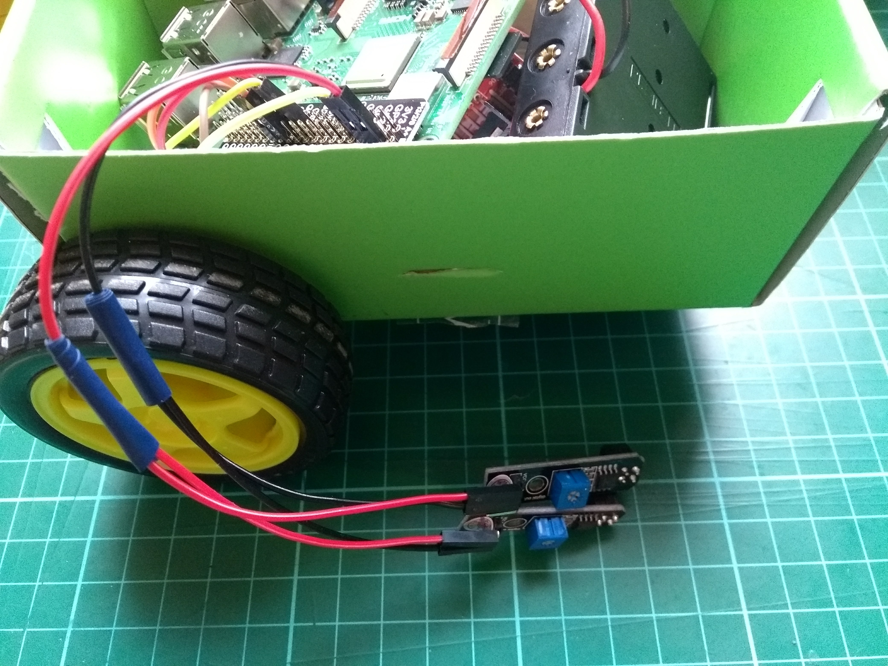

## Connecting the line sensors

Each line sensor has three pins. These are `VCC` for power, `GND` for ground, and `DO` for digital out.

--- task ---
Take one of your soldered three wire jumper combinations, and connect two of the ends to the `VCC` pins on each of the line sensors

--- /task ---

--- task ---
Take the second of your soldered jumper leads and connect two ends to the `GND` pins on the line sensors.
--- /task ---

--- task ---
Take your remaining two jumper leads and connect each one to the `DO` pins on the lines sensors
I
--- /task ---

--- task ---
Now connect the `VCC` pins of both line sensors to a `5V` pin on your Raspberry Pi, and the `GND` pins from the sensors to a `GND` pin on your Raspberry Pi. The two `DO` pins can be connected to any numbered `GPIO` pin. In this example pins `17` and `27` are used.

--- /task ---
